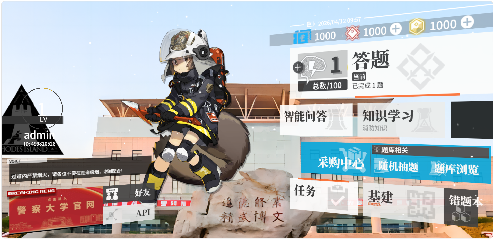

# 消防安全知识互动答题平台

基于经典明日方舟风格主界面改造的**纯前端**消防安全学习站点：答题、题库浏览、错题本、联网案例学习与多模型 AI 问答。数据与账号进度保存在浏览器 **localStorage**，无需后端即可本地使用。



## 功能概览

| 入口（主页） | 说明 |
|-------------|------|
| **答题** | 顺序练习 100 道消防判断题，记录进度、经验与等级 |
| **随机抽题** | 从题库随机抽取一组题目练习 |
| **题库浏览** | 按知识点筛选、搜索、展开查看解析 |
| **知识学习** | 通过 [Jina Search](https://jina.ai/reader/) 检索公开网页摘要，再由当前 API 配置中的模型生成案例分析 |
| **智能问答** | 消防安全向对话，支持在顶栏切换已保存的模型配置 |
| **错题本** | 汇总答错题，支持分类筛选、标记掌握与错题练习 |
| **API** | 管理多厂商密钥与模型（OpenAI 兼容接口、Anthropic Claude），供智能问答、知识学习等共用 |

其他说明：

- 开场含多段过场动画；再次进入同一浏览器会话可通过 `sessionStorage` 跳过（逻辑见 `index.html`）。
- 账号体系为本地模拟（登录/注册/切换账号），用于演示进度与昵称（默认用户名为 `admin`）。

## 快速开始

1. 克隆或下载本仓库。
2. 使用任意静态文件服务打开项目根目录（避免部分浏览器对 `file://` 的限制）：

   ```bash
   npx serve .
   # 或
   python -m http.server 8080
   ```

3. 浏览器访问 `http://localhost:8080`（端口以实际为准），打开 **`index.html`**。
4. **首次使用 AI 相关功能前**，请打开 **`api.html`**，在「DeepSeek」或你自选的配置中填写 **API Key** 并保存。密钥仅保存在本机 `localStorage`，不会上传到本项目服务器。

## API 与模型配置

- 配置文件逻辑位于 **`js/api-config.js`**，存储键为 `firetext_ai_v1`。
- **OpenAI 兼容**：DeepSeek、OpenAI、Azure OpenAI、Groq、Moonshot 等（按厂商文档填写 Base URL 与模型 ID）。
- **Anthropic**：选择 Claude 类型后使用官方 Messages API（流式解析已适配）。
- **HTTP 401**：通常表示密钥无效、过期或未填写；请在 `api.html` 中检查当前默认配置。

## 目录结构（摘要）

```
├── index.html          # 入口主页 + 开场 + 账号逻辑
├── quiz.html           # 答题
├── browse.html         # 题库浏览
├── wrongbook.html      # 错题本
├── learn.html          # 知识学习（联网检索 + AI）
├── ai-chat.html        # 智能问答
├── api.html            # 模型与密钥管理
├── questions/data.js   # 题库数据（QUIZ_DATA）
├── js/
│   ├── api-config.js   # 多模型 API 共用逻辑
│   ├── scripts.js      # 主界面脚本
│   └── src/            # 视差等第三方/历史脚本
├── css/                # 样式
└── img/                # UI 与立绘等资源
```

## 素材与版权

- 界面与 UI 贴图部分来源于对游戏资源的逆向与整理，**仅供学习交流，请勿用于商业用途**。
- 原 Arknights UI 风格实现来自 [Mashiro / arknights-ui](https://github.com/mashirozx/arknights-ui) 思路与素材使用方式；本项目在之上叠加了消防业务与 AI 相关页面。

## 许可证

本项目沿用原仓库的 **MIT License**（见根目录 `LICENSE`，Copyright 2019 Mashiro）。

使用第三方 AI、搜索等在线服务时，请遵守各服务商条款并自行承担调用费用与合规责任。
